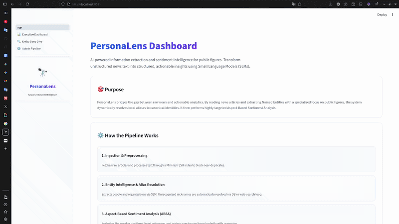
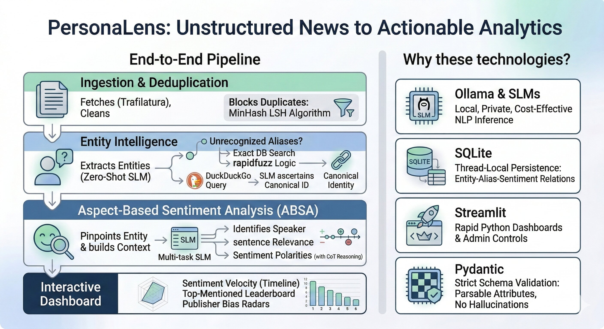
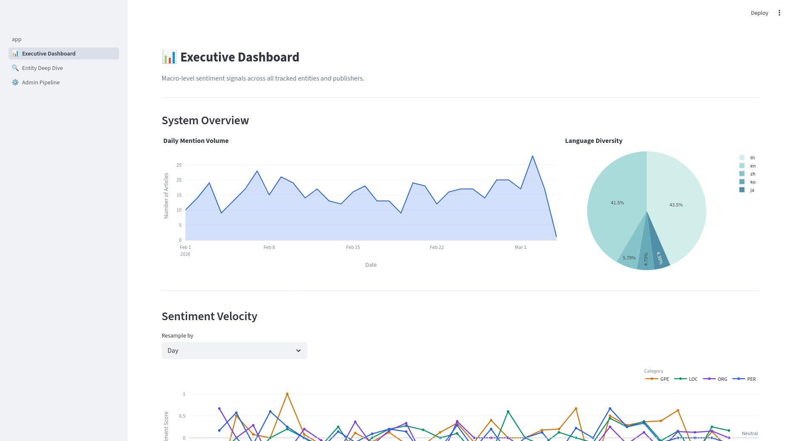
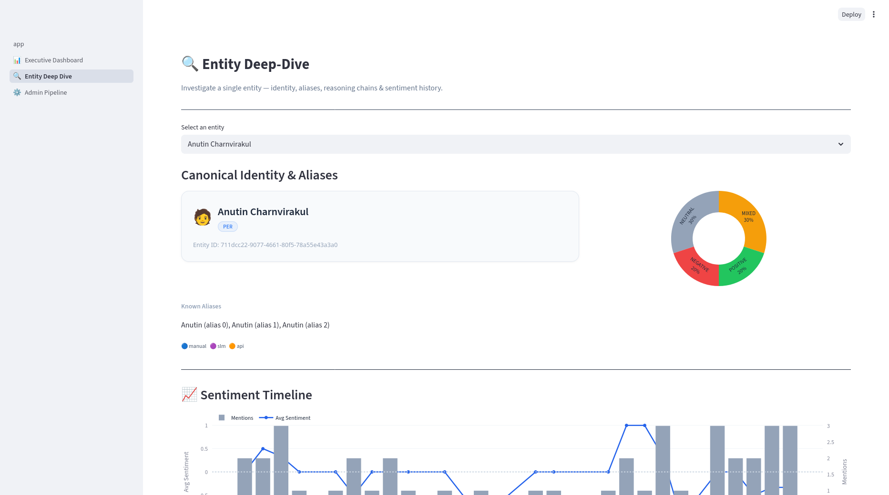
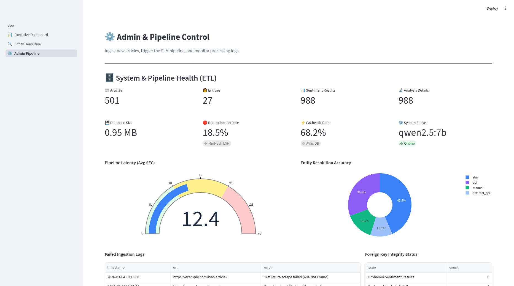

# PersonaLens

PersonaLens is an AI-powered sentiment intelligence engine that extracts, resolves, and analyzes how public figures are portrayed in unstructured news media using Small Language Models (SLMs).



## Table of Contents
- [Overview](#overview)
- [Design Boundary](#design-boundary)
- [Quick Start](#quick-start)
- [Screenshots](#screenshots)
- [Modules](#modules)
- [How to Install and Run the Project](#how-to-install-and-run-the-project)
- [How to Use the Project](#how-to-use-the-project)
- [Mock Data Generator](#mock-data-generator)
- [Credits](#credits)

## Overview

PersonaLens bridges the gap between raw unstructured news articles and actionable, structured analytics. It is designed to act as an automated media monitor focusing heavily on public persons, organizations, and locations. 

The system utilizes an end-to-end pipeline:
1. **Ingestion & Deduplication:** Fetches news using Trafilatura, cleans the text, and instantly blocks duplicate articles using a MinHash Locality-Sensitive Hashing (LSH) algorithm.
2. **Entity Intelligence:** Uses zero-shot SLM inference to extract entities, strictly mapping outputs to Python objects. Unrecognized aliases or nicknames (common in media) are resolved automatically via exact local DB search, rapidfuzz logic, or by autonomously querying DuckDuckGo and asking the SLM to ascertain the canonical identity.
3. **Aspect-Based Sentiment Analysis (ABSA):** Pinpoints the entity in the text, builds a specialized context window, and executes a multi-task SLM prompt to identify the speaker, confirm sentence grammatical relevance, and assign a precise sentiment polarity alongside granular Chain-of-Thought (CoT) reasoning.
4. **Interactive Dashboard:** Aggregates findings into a Business Intelligence dashboard displaying Sentiment Velocity over time, a Top-Mentioned Leaderboard, and Publisher Bias Radars. 

**Why these technologies?**
- **Ollama & SLMs (e.g., Qwen2.5:7b):** Allows for entirely local, private, and cost-effective NLP inference, reducing reliance on expensive closed-source APIs.
- **SQLite:** A lightweight, thread-local persistence layer capable of cleanly hosting relational entity mappings (Entities `1:N` Aliases `1:N` Sentiment Results).
- **Streamlit:** Facilitates rapid iteration of analytical dashboards and administrative controls purely in Python.
- **Pydantic:** Strictly enforced schema validation guarantees the generative SLM will return parsable attributes instead of hallucinatory text blocks.

**Challenges & Future Features:**
One of the core challenges was reigning in the non-deterministic nature of generative AI. Enforcing strict JSON outputs across zero-shot extraction and analysis steps was critical to maintaining a stable pipeline. Looking ahead, future features include real-time distributed web scraper workers, deeper network graph visualizations mapping relationships between public figures, and multi-lingual support tuning.



## Design Boundary
To maintain high precision and an efficient workflow, PersonaLens operates within specific boundaries:

### What this project Can Do
- **Zero-Shot Entity Extraction:** Automatically detect and classify people, organizations, and locations from unstructured Thai and English news text.
- **Smart Alias Resolution:** Consolidate variations of a person's name (e.g., nicknames, official titles) into a single canonical identity using a mix of Local DB matching, rapidfuzz, and autonomous Web searching.
- **Targeted Sentiment Analysis (ABSA):** Assign sentiment (Positive, Negative, Neutral, Mixed) *specifically directed* at the exact extracted public figure, rather than generally classifying the whole article.
- **Identify Speakers:** Understand contextually if a quote was said by a reporter or heavily cited as a direct external quote.
- **Data Visualization:** Output macro-trends on publisher biases, mentions, and entity sentiment timelines onto an interactive web application.

### What this project Cannot Do
- **General Article Summarization:** The engine is not tuned to spit out 3-paragraph executive summaries of news events; it is laser-focused on extracting specific entities and calculating sentiment.
- **Real-Time Data Streaming:** The system currently relies on manual ingestion or chron-job triggers; it is not hooked into a 24/7 web-socket firehose stream of social media platform data.
- **Image/Audio Processing:** The extraction and analysis are strictly limited to unstructured Text data.
- **Multi-lingual Translation on the Fly:** While it can analyze Thai and English, it does not act as a real-time translator between the two.


## Quick Start
Get up and running locally quickly via `uv`.

```bash
# 1. Create and activate virtual environment
uv venv
source .venv/bin/activate

# 2. Install dependencies (Requires uv)
uv pip install -r requirements.txt

# 3. Initialize the database (creates all tables + indexes automatically on first use)
python -c "from database.database import Database; Database()"

# 3.1 (optional) Create mock data
uv run mockdata/gen_mockdata.py

# 4. Run the Streamlit app
uv run streamlit run app/app.py
```

## Screenshots
*(Insert screenshots of your application here)*

- **Executive Dashboard:**
  
- **Entity Deep-Dive:**
  
- **Real-Time Admin Pipeline:**
  

## Modules

The application's architecture is segmented into decoupled, distinct modular components:
1. **Ingestion Module (`src/engine/preprocessor.py`):** Responsible for fetching raw network data, cleaning the text, and detecting near-duplicates using LSH MinHash. 
2. **Entity Linking Module (`src/engine/entity_linker.py`, `alias_resolver.py`, `external_validator.py`):** Orchestrates NER extraction and handles sophisticated alias mapping algorithms (Local DB → Fuzzy Logic -> DuckDuckGo Search Validation).
3. **Sentiment Analysis Module (`src/engine/analyzer.py`):** Constructs character-level segmented context windows around a target entity and prompts the SLM to perform grammatical Aspect-Based Sentiment Analysis.
4. **Interface & Dashboard Module (`app/app.py`):** Holds the Streamlit layout routing and dashboard Plotly implementations logic.
5. **Persistence Module (`database/database.py`):** Houses the bespoke, thread-secure SQLite 3 wrapper, handling automatic table creation, complex upserts, and foreign key relations.

## How to Install and Run the Project

Follow these steps to set up the PersonaLens development environment locally:

### Prerequisites
- Python 3.11+
- [uv](https://github.com/astral-sh/uv) (Extremely fast Python package installer)
- [Ollama](https://ollama.ai/) running locally with an SLM model installed (e.g., `ollama run qwen2.5:7b`).

### Installation
1. **Clone the repository and setup environments:**
   ```bash
   uv venv
   source .venv/bin/activate
   ```

2. **Install dependencies using `uv`:**
   ```bash
   uv pip install -r requirements.txt
   ```

3. **Initialize the Database:**
   The SQLite connection automatically manages the creation of tables via internal DDL execution the first time it is instantiated. To force instantiation manually:
   ```bash
   python -c "from database.database import Database; Database()"
   ```

4. **Launch the Dashboard:**
   Start the interactive frontend.
   ```bash
   uv run streamlit run app/app.py
   ```

## How to Use the Project

Once the Streamlit dashboard is running locally, navigate to `http://localhost:8501` in your browser. The sidebar contains exactly what you need to navigate the tool:

1. **Admin & Pipeline (`app/pages/3_Admin_Pipeline.py`):** 
   Head here first. You can manually ingest raw news article bodies or paste a URL to have Trafilatura fetch it. When you hit submit, the UI yields a real-time console log showing every active step of the AI analysis, right down to the database persisting the analytical reasoning. 
2. **Entity Deep-Dive (`app/pages/2_Entity_Deep_Dive.py`):**
   Once data is ingested, select an extracted person (e.g., Anutin). Review the aliases the engine associated with them, view a chronological sentiment timeline, and open the exact "Chain of Thought" snippet explorer to see *why* the AI assigned a negative or positive score to a specific sentence.
3. **Executive Dashboard (`app/pages/1_Executive_Dashboard.py`):**
   View macro-level aggregates. Look at the radar charts to identify publisher bias clusters, or check the Leaderboard to see which entities command the highest volume of news mentions.


## Mock Data Generator

The project includes a utility script that dynamically generates realistic mock data directly into your `database/personalens.db` file. This lets you experiment with the Executive Dashboard and Entity Deep-Dive views right away without waiting for real data ingestion.

To inject 500 mock intelligence records into your local database, run:
```bash
python mockdata/gen_mockdata.py
```

This acts natively through the project's persistence layer to map entities (categorized realistically as PER, ORG, LOC, GPE), calculate accurate foreign keys, and supply varied confidence scores across multiple publishers.

## Credits

This project serves as a showcase of SLM extraction architectures. 
Technologies leveraged under the hood include:
- [Ollama](https://github.com/ollama/ollama)
- [Streamlit](https://streamlit.io/)
- [Pydantic](https://docs.pydantic.dev/latest/)
- [RapidFuzz](https://github.com/rapidfuzz/RapidFuzz)
- [Trafilatura](https://github.com/adbar/trafilatura)
- [Plotly](https://plotly.com/python/)