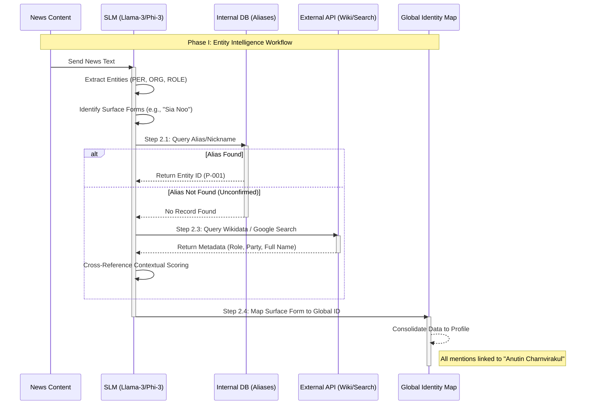
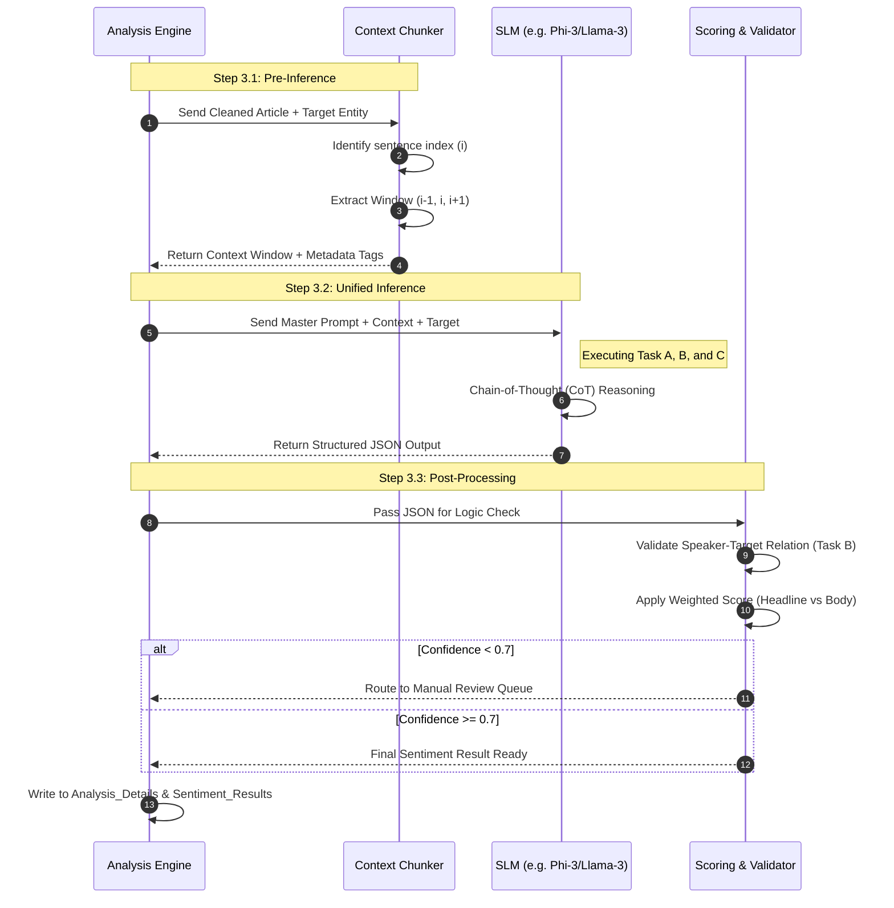
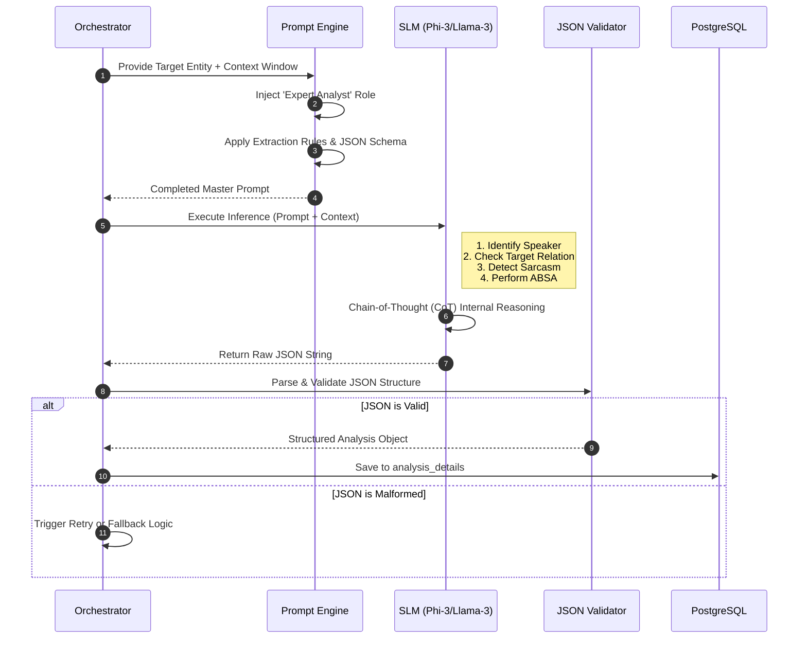
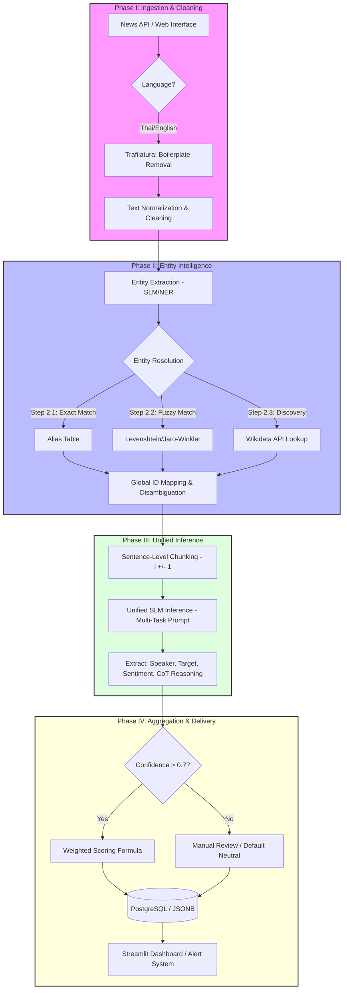

# System Context: Unified Workflow for Entity Intelligence

## 1. Overview

The core objective is to transform raw, unstructured news data into a high-fidelity **Knowledge Base**. The architecture follows the principle of **"Identity First, Sentiment Second"**: the system must accurately identify **who** is being discussed (Entity Linking) before analyzing **how** they are being discussed (Sentiment Analysis).


---

## 2. Phase I: Ingestion & Entity Intelligence

### Data Preparation

1. **Ingestion & Cleaning**:
* **Data Acquisition**: Replaces traditional scraping with **News API** integration or manual data entry via a **Web Interface**.
* **Language Support**: Native multi-language support for both **Thai** and **English** text.
* **Boilerplate Removal**: Utilization of tools like `trafilatura` to strip metadata, ads, and menus.
* **Normalization**: Standardization of whitespace and correction of language-specific typos (critical for Thai script).


### Entity Intelligence: From "Words" to "Identity" (Extraction & Resolution)

This phase has been upgraded with a **Small Language Model (SLM)** layer to act as an "Intelligence Officer," identifying and linking identities even when referred to by nicknames, roles, or aliases.

#### **Step 2.1: SLM-Based Entity Extraction (NER+)**

Instead of relying on rigid Regex or basic NLP, we deploy a **Small Language Model (e.g., Llama-3-8B or Phi-3)** fine-tuned for Thai/English NER to:

* **Identify Entities**: Extract People (**PER**), Organizations (**ORG**), and Roles (**ROLE**) directly from the news text.
* **Contextual Tagging**: Distinguish between a "Surface Form" (what is written) and the "Context." For example, in the sentence *"Sia Noo visited the flood zone,"* the SLM flags **"Sia Noo"** as a Person entity.

#### **Step 2.2: Semantic Alias Resolution (The "Alias Bridge")**

To handle different names referring to the same person (e.g., "Sia Noo," "Anutin," "Minister of Interior"):

* **Internal Lookup**: Check the local `entity_aliases` table to see if the term is a known nickname or formal alias.
* **Logic Trigger**: If the term is a title (e.g., "The PM") or a localized nickname (e.g., "Sia..."), the system triggers a deep semantic check.

#### **Step 2.3: External Identity Validation (Google Search & Wiki API)**

If the SLM encounters an unconfirmed or ambiguous entity (e.g., a new political nickname), it performs **Dynamic Verification**:

* **Wikidata/Wikipedia API**: Queries structured data to see if *"Sia Noo"* is linked to the QID for *"Anutin Charnvirakul."*
* **Search API (DuckDuckGo)**: In cases of breaking news or recent nicknames, the system analyzes top search snippets to determine who the media is currently referring to by that name.
* **Cross-Referencing**: Validates the search results against other context clues in the article, such as political party or current office.

#### **Step 2.4: Disambiguation & Global ID Assignment**

* **Contextual Scoring**: If names are identical (e.g., two politicians with the same name), the system calculates a probability score based on surrounding keywords (e.g., "Buriram" or "Bhumjaithai Party" would weight the result toward "Anutin").
* **Global ID Mapping**: Once the identity is confirmed, the mention is mapped to a **Global ID**, centralizing all news data into a single, unified profile.


### Identity Resolution Comparison Table

| Mention in News (Surface Form) | SLM & API Analysis | Resolved Identity |
| --- | --- | --- |
| **"Sia Noo"** | Wiki/Search confirms this is a common alias for Anutin. | Anutin Charnvirakul (ID: P-001) |
| **"Minister of Interior"** | Cross-references the current office holder on the news date. | Anutin Charnvirakul (ID: P-001) |
| **"Anutinn"** | Fuzzy Matching + Context Match for typo correction. | Anutin Charnvirakul (ID: P-001) |


Here is the sequence diagram illustrating the **Entity Intelligence** workflow, from the initial news ingestion to the final Global ID assignment.




---

## 3. Phase II: Pre-Inference & Unified SLM Analysis

### Pre-Inference Chunking (Context Optimization)

* **Target Focusing**: Extract the sentence containing the `[TARGET_ENTITY]` plus the immediate surrounding sentences ($i \pm 1$).
* **Metadata Attachment**: Explicitly tag the specific target to be analyzed to avoid confusion in multi-entity articles.

### Unified SLM Inference (Multi-Task Prompting)

The Small Language Model (SLM) executes three tasks in a single pass:

* **Task A (Speaker Identification)**: Identify if the text is a reporter's narrative or a direct quote from a specific person.
* **Task B (Target Relation)**: Determine if the sentiment is "aimed" at the target to resolve **Quotation Contamination**.
* **Task C (ABSA)**: Execute Aspect-Based Sentiment Analysis specifically for the `[TARGET_ENTITY]`.


#### Unified SLM Inference Sequence: Single-Pass Analysis



#### Senior's Breakdown: The Heart of This Sequence

* **The Power of Context ($i pm 1$):** Chunking in steps 3 and 4 is the best way to reduce noise. Instead of having the SLM read the entire news article, we force it to focus only on the "point of incident," resulting in higher accuracy and saving computing costs.
* **The Single Pass Efficiency (Step 7):** This is the point that saves the most time. Instead of calling the model three times (separating Tasks A, B, and C), we call it once and have the model extract the data as JSON. This method helps the model maintain its context better than processing it separately.
* **The Logic Check (Step 11):** As a system administrator, we need a "checkpoint." If `is_target_the_subject` is `false`, the system must immediately know whether someone else is talking about Target or Target is talking about someone else, to prevent scores from being misplaced.


#### Senior's Technical Advice (Performance & Reliability)

* **Prompt Versioning:** I recommend storing `Prompt_ID` in the `analysis_details` table. This way, when you rework the Prompt in the future, you can review whether the changed result was due to the Model or the Prompt.
* **Handling JSON Errors:** Small SLMs may sometimes forget to close curly braces `{}` or break JSON. I recommend using libraries like `pydantic` or `instructor` in Python to enforce data structures. (Schema Validation) Before sending to be saved to the database.
* **Token Budgeting:** For English-language news, 1 Context Window ($i pm 1$) usually does not exceed 150-200 tokens, which is considered "very good" for SLMs with a Context Window of 4k or 8k.


---

## 4. The Master Prompt (Unified Version)

**Role**: Expert Political News Analyst

**Task**: Extract Entity Relations and Sentiment

**Extraction Rules**:

1. **Identify 'Speaker'**: Who is expressing the opinion? (e.g., "The Reporter", or a specific Name).
2. **Identify 'Impact Target'**: Who is this sentiment actually about?
3. **Sarcasm Check**: Detect polite but ironic Thai phrasing.

**JSON Output Format**:

```json
{
  "analysis": [
    {
      "sentence": "string",
      "speaker": "name_of_speaker",
      "is_target_the_subject": boolean,
      "sentiment": "positive/negative/neutral",
      "confidence": 0.0-1.0,
      "reasoning": "brief explanation of speaker vs target impact"
    }
  ]
}

```


#### Unified Extraction & Sentiment Sequence



#### Senior's Breakdown: Why is this order important?

* **The Contract (Step 3):** Inserting JSON Schema into the Prompt is like making a "contract" with the AI. At the senior level, we don't gamble on what the AI ​​will answer, but we **force** it to answer only in the format we want.
* **The Black Box (Step 6):** Although it looks like a single step in the diagram, internally the SLM is performing **Task Switching** between identifying the speaker and analyzing sentiment. The brilliance of the Master Prompt lies in making the AI ​​"connect" these two things at once.
* **The Safety Net (Step 8):** As a project manager, I always emphasize **"Don't trust the AI ​​100%."** Having a JSON Validator (such as Pydantic in Python) to intercept before entering data into the database is what separates student-level projects from enterprise-level projects.


#### Senior's Technical Advice (Prompt Optimization)

* **One-Shot vs. Zero-Shot:** If you find that the SLM is starting to give "inaccurate" answers... If you don't follow the JSON format, it's recommended to include an **Example** (example sentence + correct JSON result) in the prompt. This will reduce the rate of malformed JSON by almost 100%.
* **Token Efficiency:** Using short JSON keys (e.g., `spk` instead of `speaker`, `sent` instead of `sentiment`) will save tokens and slightly speed up SLM processing, which is significant when processing tens of thousands of news items.
* **Temperature Setting:** For this type of data extraction task, setting `temperature = 0` or `0.1` should ensure the AI ​​provides the most straightforward and consistent (deterministic) answers.


---

## 5. Senior-Level Optimization Strategies

### A. Prompting & Logic

* **Chain-of-Thought (CoT)**: (Priority: 97) Force the model to generate a "Reasoning" process before providing JSON to improve sentiment accuracy.
* **Logical Post-Processing**: (Priority: 93) Use Python to double-check results. If `speaker == target` but sentiment is `negative`, flag for review (as public figures rarely self-attack).

### B. Scoring & Aggregation

* **Weighted Sentence Aggregation**: (Priority: 92) Analyze sentence-by-sentence rather than summarizing the whole article.
* **Final Sentiment Formula**: (Priority: 90)

$$Sentiment_{Final} = \frac{\sum (Score_i \times Confidence_i \times Weight_i)}{\sum Weight_i}$$


*Note: Headlines receive a **1.5x weight** compared to body text.*

### C. Reliability & Identity

* **Hybrid Resolution**: Combine Alias Dictionaries + Vector Similarity + Wikidata API.
* **Confidence Threshold**: (Priority: 95) If confidence $< 0.7$, default to "Neutral" or route to a **Manual Review** queue to maintain dashboard reliability.

---

### News Intelligence Data Pipeline



#### Workflow Details by Phase (Senior's Breakdown)

1. **Phase I (Ingestion):** Focuses on the quality of raw data. If the data isn't cleaned properly from the start, SLM will lose tokens to junk (ads/menus) and cause errors in context window creation.
2. **Phase II (Entity Intelligence):** This is the most crucial "sorting" point. We use a **Hybrid Approach** to ensure that news from multiple sources, even those with different names, is correctly identified. They will be merged into a single Global ID in the database.
3. **Phase III (Unified Inference):** This is where we use SLM the most (Cognitive Load) by performing **Multi-Tasking** to differentiate "who is insulting whom" in a single sentence.
4. **Phase IV (Aggregation):** This is the final polishing step before displaying the results on the dashboard. It involves filtering the Confidence Score to maintain the reliability of the data.

#### Senior's Technical Advice (Pipeline Optimization)

* **Async Processing:** If you have a large number of incoming news (Batch), it is recommended to use a **Task Queue** such as `Celery` or `RabbitMQ` in Phase III because calling SLM Inference is often the slowest point (Bottleneck).
* **Checkpointing:** The `articles` table should have a status such as `processed`, `failed`, `pending` to ensure the pipeline is functioning correctly. It can resume from where it left off if the system crashes.
* **Monitoring:** Create a small dashboard to see how many entities the system "cannot find" each day and need to call Wikidata to measure the performance of our Alias ​​Table.


---

