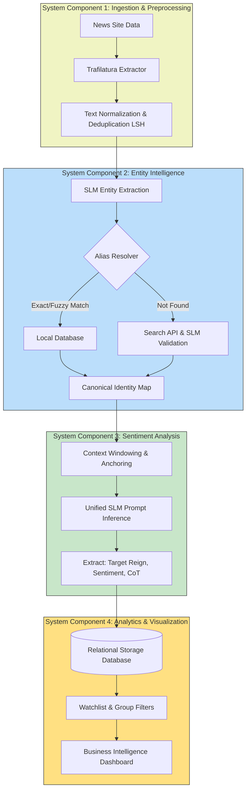

# System Context: Information Extraction and Data Analytics via SLM

## 1. Project Overview

The core objective is to extract information from unstructured news data using Small Language Models (SLMs) and data analytics. The system focuses on reading newspapers, performing Named Entity Recognition (NER) with a specific focus on public persons, conducting sentiment analysis (positive or negative), and providing the enriched data into an analytic tool for visualization and actionable insights. The system also supports optionally focusing on a specific group or watchlist of public persons.

## 2. System Components

The architecture is divided into modular components that handle the end-to-end pipeline from data ingestion to analytical visualization. Outlined below are the core components to be developed:

### 2.1. Ingestion and Preprocessing Component
- **Responsibility**: Fetching raw news articles, cleaning text, and storing unique records.
- **Key Modules**:
  - **Data Acquisition**: Website scrapers and parsers (e.g., Trafilatura) for extracting text and metadata from news URLs.
  - **Text Normalization**: Unicode normalization, stripping HTML, and language-specific whitespace correction.
  - **Deduplication Engine**: An index logic to detect and block near-duplicate articles before storage.
  - **Storage Manager**: Relational database operations to persist cleaned articles.

### 2.2. Entity Intelligence Component
- **Responsibility**: Identifying public persons and resolving aliases to a canonical identity.
- **Key Modules**:
  - **SLM NER Engine**: Prompts the SLM to extract Persons (PER), Organizations (ORG), and Locations. Schemas are strictly enforced during generation.
  - **Local Alias Resolver**: Local database matching to compare extracted names against known aliases.
  - **External Validator**: Search API integration coupled with SLM validation to dynamically resolve unknown entities based on real-time internet context.

### 2.3. Inference and Sentiment Analysis Component
- **Responsibility**: Executing Aspect-Based Sentiment Analysis (ABSA) specifically for targeted entities.
- **Key Modules**:
  - **Context Windowing**: Segmenting text using natural language processor libraries to isolate sentences containing the target entity.
  - **Entity Anchoring**: Wrapping the target entity with specific markers to direct the SLM's attention.
  - **Unified Multi-Task SLM**: Single-pass prompt inference using pre-defined templates to identify the speaker, verify target relevance, and map sentiment classifications (Positive / Negative).

### 2.4. Data Storage and Schema Management Component
- **Responsibility**: Guaranteeing data integrity and managing inference payloads throughout the pipeline.
- **Key Modules**:
  - **Schema Validation Layer**: Data validation models governing the exact input and output JSON structures used by the SLM.
  - **Relational Storage**: Tables storing records of articles, mapped entities, alias dictionaries, and granular analysis details.

### 2.5. Analytic and Visualization Component
- **Responsibility**: Aggregating processed inference data and presenting actionable insights.
- **Key Modules**:
  - **Watchlist Filter**: Module allowing filtering to focus exclusively on a specific group of public persons based on roles, parties, or occurrences.
  - **Dashboard Interface**: A web-based Business Intelligence interface that translates structured database outputs and statistical aggregates into visual graphs (e.g., Sentiment Trends Over Time, Entity Network Graphs).

---

## 3. Technical Solution and Algorithms

The pipeline processes data sequentially, applying distinct technical solutions and algorithms to address natural language extraction challenges.

### 3.1. Text Ingestion and Deduplication Algorithm
1. Retrieve raw text and metadata via network fetching.
2. Clean text by normalizing unicode characters and converting language-specific variations.
3. Convert text into overlapping 5-gram shingles.
4. Calculate MinHash signatures across the shingles.
5. Compute the Jaccard similarity index against an in-memory index. If similarity is >= 0.8, flag as a near-duplicate and discard; otherwise, persist the unique article to the database.

### 3.2. SLM-Driven Entity Extraction (NER) Algorithm
1. Provide the cleaned text as context to the SLM.
2. Inject system instructions strictly defining the entity extraction constraints (focusing heavily on public persons).
3. Apply structured schema configurations to the generation endpoint, explicitly forcing the model's token distribution to output strictly formatted JSON payloads.
4. Deserialize the response string into strongly typed objects. If format deviates or parsing fails, catch the error to mitigate hallucination risks.

### 3.3. Identity Resolution Algorithm (The Alias Bridge)
When tracking public persons, media sources often use localized nicknames or aliases. The system employs a multi-tier resolution algorithm:
1. **Tier 1 (Exact Match)**: Direct string query of the extracted term against the internal alias database. Case-insensitive checking. If found, return the canonical identity.
2. **Tier 2 (Fuzzy Match)**: Apply the Levenshtein distance algorithm on all associated aliases. Calculate the token sort ratio. If the highest match score is >= 0.88, accept the fuzzy match and map the entity.
3. **Tier 3 (External Web Validation)**: If local matching fails entirely, formulate an automated search engine query. Execute external API calls to fetch the top 5 search snippets. Supply snippets to the SLM to deduce the canonical identity. If the SLM confidence is high enough (>= 0.75), persist this new discovery to the local database to accelerate future queries.

### 3.4. Target-Specific Sentiment Analysis Algorithm
Instead of blindly evaluating the entire news article, the system performs local context sentiment analysis restricted to the mentioned person:
1. **Target Location**: Locate the character index of the resolved entity within the text.
2. **Context Windowing**: Extract the target sentence $i$ and span outwards to extract adjacent sentences $i-1$ and $i+1$. 
3. **Anchoring**: Inject explicit markers directly into the text around the entity name to focus the underlying AI attention mechanisms.
4. **Multi-Task Prompt Inference**: Send the anchored text to the language model to execute three sequential logic steps internally:
   - Check the sentence structure to identify the speaker (Reporter vs. External Quote).
   - Trace grammatical relevance to determine if the negative or positive phrasing is specifically directed at the identified target.
   - Assign the final polarity classification (Positive or Negative).
5. Persist the generated reasoning and sentiment scores into the analysis database.

### 3.5. Analytics Aggregation and Group Identification Algorithm
1. Query the primary database for sentiment results aggregated by entity identifier.
2. Identify the entities passing the watchlist constraints (if a specific group of public persons is targeted).
3. Compute weighted sentiment averages across the specified time frame by weighting the inference confidence scores against document factors (e.g., giving 1.5x weight multipliers to target references found in article headlines compared to standard body text).
4. Restructure output data pipelines to feed the visualization frontend.

---

## 4. System Architecture Flow

