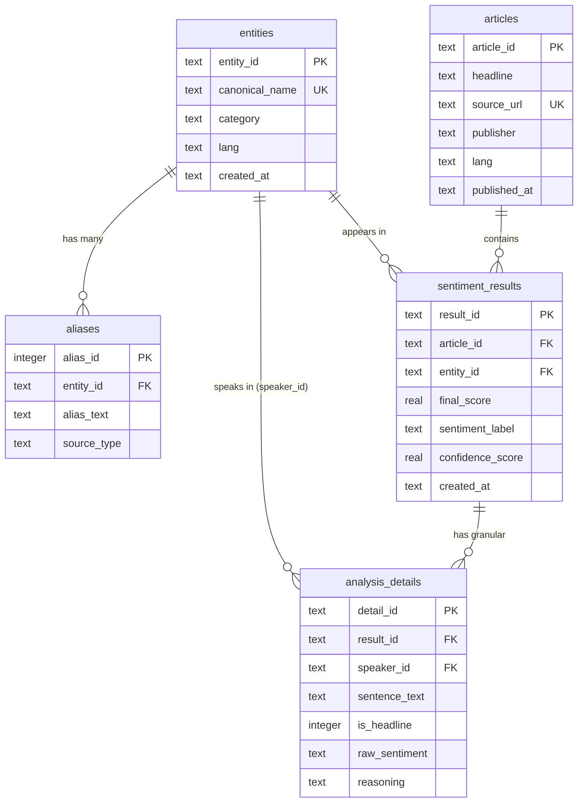

# Database Module (database/database.py)

## Purpose (LLM Context)
This README acts as the definitive specification for `database/database.py`. It enables LLM agents to fully understand the persistence layer for PersonaLens without needing to read the raw Python file.

The file provides a thread-local SQLite wrapper that abstracts SQL queries away from the core application logic. It relies on the standard sqlite3 library to handle database operations (DDL creation, row inserts/updates, and select queries) aligned precisely with the project's ERD.

---

## Folder Structure
The file sits in the top-level database directory.
```text
database/
├── database.py       # Core SQLite wrapper class and DDL queries
└── personalens.db    # The actual SQLite database file (generated at runtime)
```

---

## How the Pipeline Works (Execution Flow)
1. **Initialization:** When the `Database` class is instantiated, it establishes a connection to the SQLite database file (or an in-memory database if `:memory:` is used).
2. **Bootstrapping (DDL Execution):** Upon connection, `_bootstrap()` runs automatically. It executes the predefined DDL layout to create 5 core tables (`entities`, `aliases`, `articles`, `sentiment_results`, `analysis_details`) and the required indexes, with features like Write-Ahead Logging (WAL) and Foreign Keys turned on.
3. **Data Ingestion & Resolution (Upsertion):** Most operations follow an "Upsert" pattern (Insert or Ignore). Methods like `upsert_entity` or `upsert_article` will first query by a unique constraint (e.g., `canonical_name` or `source_url`). If the record exists, the method returns the existing primary key ID. If not, it inserts the new record, generates a standard UUID4, commits the transaction, and returns the new ID.
4. **Result Persisting:** When saving an `AnalyzerResult`, the pipeline:
   - Resolves the article and the target entity (upserting if necessary).
   - Maps the textual sentiment label into a numeric score (-1.0 to 1.0).
   - Resolves the speaker entity automatically if the text is identified as a quote.
   - Writes the high-level `sentiment_results` row.
   - Submits the granular `analysis_details` row (storing the exact context window and full ABSA JSON reasoning).
5. **Data Retrieval:** Convenience methods are available to fetch sentiment rows joined with article metadata, and to load known aliases into memory for the entity linker.
6. **Teardown:** The connection can be safely closed manually via `.close()` or automatically via Context Manager.

---

## Entity-Relationship Diagram (ERD)



---

## Public Functions (Database Class Methods)
Since the module is class-based, the public API consists of methods belonging to the `Database` class.

- `__init__(path)`: Initializes the SQLite connection and enforces the table schemas. Default path is `database/personalens.db`.
- `upsert_entity(canonical_name, category, lang, entity_id)`: Inserts an entity if it does not exist (based on canonical_name constraint) and returns its UUID.
- `get_entity_by_name(canonical_name)` / `get_entity_by_id(entity_id)`: Returns the entity `sqlite3.Row` if found, else None.
- `upsert_alias(entity_id, alias_text, source_type)`: Inserts a new alias text for an entity and returns the alias ID.
- `get_aliases(entity_id)`: Returns all aliases linked to a specific entity UUID.
- `find_alias_exact(surface_form)`: Case-insensitive precise lookup for an alias. Returns the entity details if matched.
- `find_all_aliases_with_entities()`: Fetches all aliases joined with their parent entity details (used heavily by fuzzy matching).
- `upsert_article(source_url, headline, publisher, lang, published_at, article_id)`: Inserts an article uniquely mapped by its URL and returns its UUID.
- `save_analyzer_result(result, article_id, source_url, headline, publisher, lang, published_at, is_headline)`: The main orchestration method. Takes a Pydantic `AnalyzerResult`, runs upserts for articles/entities, stores numeric SLA mappings in `sentiment_results`, saves reasoning JSON in `analysis_details`, and returns the `result_id`.
- `get_sentiment_results(entity_id, limit)`: Returns recent sentiment analysis details joined with their parent article data.
- `get_analysis_details(result_id)`: Retrieves the localized analysis rows for a specific result entry.
- `close()`: Closes the active database connection.

---

## Private Functions
The class utilizes internal helper functions prefixed with an underscore `_` to manage the SQL state:
- `_bootstrap()`: Automatically called during instantiation. Runs the initial PRAGMA setups and `CREATE TABLE IF NOT EXISTS` routines explicitly mapped in the `_DDL` constant.
- `_now()`: A static helper that fetches the correct ISO-8601 UTC timestamp format (`datetime.now(timezone.utc).isoformat()`).
- `_new_uuid()`: A static helper returning a randomly generated standard UUID4 string natively.

---

## Usage
The wrapper uses modern Python context managers to guarantee safe connection handling.

```python
from database.database import Database
# Assumes `absa_result` is a valid src.schemas.inference.AnalyzerResult object

def persist_analysis(absa_result):
    # Setup connection using context manager for safe teardown
    with Database("database/personalens.db") as db:
        
        # Save a completed AnalyzerResult directly
        save_id = db.save_analyzer_result(
            result=absa_result,
            source_url="https://news.example.com/article/1",
            headline="Health Minister announces new policy",
            publisher="Example News"
        )
        
        # Retrieve data directly to confirm
        details = db.get_analysis_details(save_id)
        for row in details:
            print(f"Sentence context: {row['sentence_text']}")
            print(f"Raw sentiment: {row['raw_sentiment']}")
            print(f"Full ABSA rationale: {row['reasoning']}")
```
