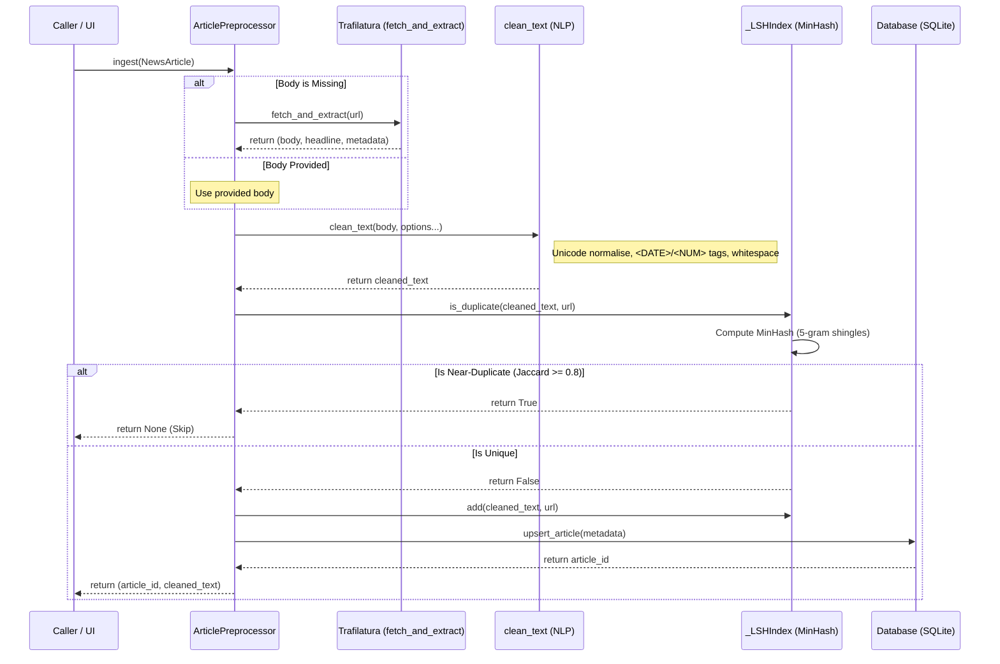
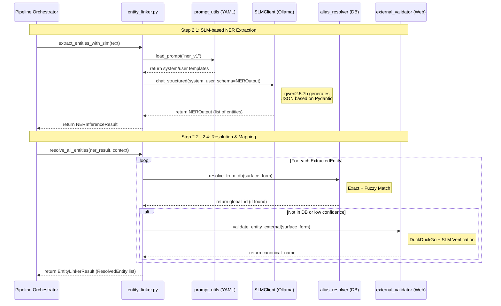
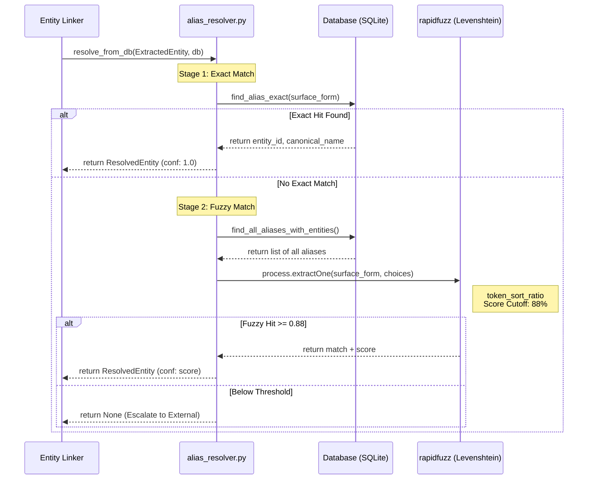
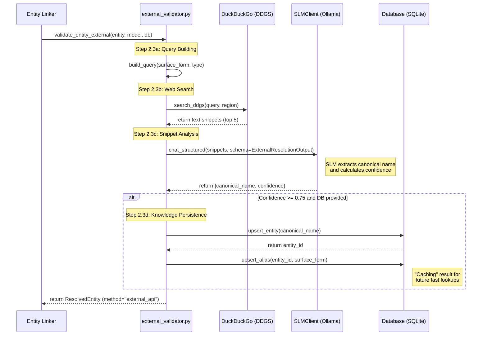
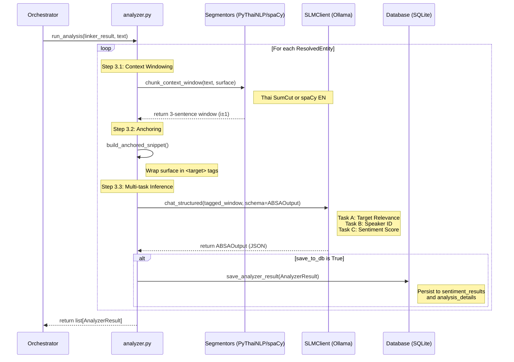

# Inference Engine (`src/engine/`)

## Purpose (LLM Context)
This README acts as the definitive specification for the `src/engine/` directory. It enables LLM agents to fully comprehend the core execution pipeline of PersonaLens without needing to read the raw Python files. 

The `src/engine/` module forms the backbone of the application. It orchestrates a multi-step Natural Language Processing (NLP) pipeline that transforms raw unstructured news text into structured, database-persisted analytics. It achieves this by bridging local heuristics, database lookups, external search API calls (DuckDuckGo), and heavily structured SLM (Ollama) inference.

---

## Folder Structure
The engine directory is structured sequentially matching the theoretical pipeline phases.
```text
src/engine/
├── preprocessor.py        # Step 1: Text cleaning and deduplication
├── entity_linker.py       # Step 2: Orchestrates NER and identity resolution
├── alias_resolver.py      # Step 2.2: Fast local SQLite exact & fuzzy lookup
├── external_validator.py  # Step 2.3: DuckDuckGo search + SLM confirmation
├── analyzer.py            # Step 3: Phase II ABSA Analysis (Sentiment/Aspects)
└── slm_client.py          # Universal: Low-level structured Ollama wrapper
```

---

## How the Pipeline Works (Execution Flow)
The entire engine executes linearly.

1. **Step 1 - Preprocessing (`preprocessor.py`)** 
   A raw `NewsArticle` (either text body or URL) is fetched using Trafilatura. The text undergoes unicode normalization, HTML stripping, and optional date/number tokenization. It is then converted into 5-gram shingles and checked against an in-memory MinHash LSH index (Jaccard threshold 0.8) to block near-duplicates. If it passes, it is saved to the SQLite `articles` table.


   
2. **Step 2.1 - NER Extraction (`entity_linker.py`)** 
   The cleaned text is passed to `extract_entities_with_slm()`. This loads the `ner_v1` YAML prompt and asks the SLM to pull out people (PER), organizations (ORG), locations (LOC), etc. It guarantees strict JSON via Pydantic schema validation.



3. **Step 2.2 - Semantic Alias Resolution (`alias_resolver.py`)**
   For each entity found, the engine checks the local SQLite Database (`aliases` & `entities` tables). It first tries an Exact Case-Insensitive Match. If that fails, it uses `rapidfuzz` (Levenshtein token sort ratio >= 0.88) to find a Fuzzy Match.



4. **Step 2.3 - External Validation (`external_validator.py`)**
   If Step 2.2 fails to find the entity, the engine builds a localized search query and triggers DuckDuckGo (DDGS). The top 5 text snippets returned from the internet are fed back into the SLM to ascertain the canonical name of the entity. If the SLM confidence is >= 0.75, it saves this new alias back into the SQLite local DB so future hits use Step 2.2.



5. **Step 3 - Aspect-Based Sentiment Analysis (`analyzer.py`)**
   The resolved entities are mapped back to their positions in the text. `chunk_context_window()` uses PyThaiNLP or spaCy to isolate the target sentence +/- 1 surrounding sentence. `build_anchored_snippet()` tags the entity with `<target>` tags. Finally, `analyze_entity()` asks the SLM for Task A (Speaker Type), Task B (Aimed at Target check) and Task C (Sentiment/Aspects) simultaneously.



---

## Public Functions (Module Deep Dive)

### `slm_client.py`
- `SLMClient(model, host, options)`: Wrapper class around the native `ollama` SDK.
- `chat_structured(system_prompt, user_prompt, schema, model)`: Sends prompts to Ollama. It calls `schema.model_json_schema()` to constrain the AI response format, then uses `schema.model_validate_json()` to return a typed Python object safely.
- `ping()`: Confirms the Ollama server is alive.

### `preprocessor.py`
- `ArticlePreprocessor(db, replace_dates, replace_numbers, lowercase, dedup_threshold)`: The stateful manager holding the LSH index session.
- `ingest(article: NewsArticle) -> tuple[str, str]`: Orchestrates Trafilatura URL fetching, NFKC text cleaning, Minhash deduplication checks, and `articles` table DB storage. Returns `(article_id, cleaned_body)`.
- `fetch_and_extract(url: str) -> dict`: Wraps Trafilatura. Returns `body`, `headline`, `publisher`, and `published_at`.
- `clean_text(text, replace_dates, replace_numbers, lowercase) -> str`: Runs regex normalizations over the raw text string.

### `entity_linker.py`
- `extract_entities_with_slm(text, model_name, prompt_id) -> NERInferenceResult`: Executes Step 2.1. Loads the prompt YAML, invokes `SLMClient`, and validates the output against `NEROutput` schema.
- `resolve_all_entities(ner_result, article_context, session, model_name, article_date) -> EntityLinkerResult`: Orchestrator that loops over extracted entities and pipelines them into `alias_resolver` and `external_validator`. 

### `alias_resolver.py`
- `lookup_alias_exact(surface_form, db) -> tuple[UUID, str]`: Does a fast SQL `SELECT` to match an existing alias accurately.
- `lookup_alias_fuzzy(surface_form, db, threshold) -> tuple`: Loads all aliases into memory, uses `rapidfuzz.process.extractOne` to find a match above the default threshold (0.88).
- `resolve_from_db(entity, db) -> ResolvedEntity | None`: Ties exact and fuzzy matching together. Returns None if unresolvable locally.

### `external_validator.py`
- `build_query(surface_form, entity_type) -> str`: Generates smart English search queries like "who is [X] full name" to ask search engines.
- `search_ddgs(query, surface_form, max_results) -> list[str]`: Makes the HTTP request to DuckDuckGo search. Auto-detects region based on the language of `surface_form`.
- `validate_with_slm(...) -> ExternalResolutionOutput | None`: Pushes DDGS snippets to Ollama to figure out the Canonical Name and return a float Confidence score.
- `validate_entity_external(...) -> ResolvedEntity | None`: Orchestrator that ties search and SLM tools together, then triggers SQLite `upsert_alias` if confidence is >= 0.75.

### `analyzer.py`
- `chunk_context_window(text, target_surface, lang, window) -> str`: Utilizes `PyThaiNLP` to cut Thai phrases into discrete sentences, returning `[target_idx - 1 : target_idx + 1]`.
- `build_anchored_snippet(window, target_surface, target_description) -> tuple[str, str]`: Non-regex based replacement that wraps the entity in `<target>` XML tags to guide SLM focus.
- `analyze_entity(...) -> AnalyzerResult`: Formats the tagged text and description into the `absa_analysis` prompt YAML and executes structured SLM inference against the `ABSAOutput` Pydantic class.
- `run_analysis(...) -> list[AnalyzerResult]`: The loop orchestrator representing Phase II. Can trigger SQLite `db.save_analyzer_result` automatically if configured.

---

## Private Functions
Internal helper functions are denoted by a leading underscore `_`.
- `preprocessor.py`: Internal implementations include `_shingle()` and `_compute_minhash()` for deduplication logic. Contains `_LSHIndex` internal class.
- `external_validator.py`: Includes `_detect_region(text)` using langdetect, and `_upsert_entity_and_alias(...)` for direct SQLite communication.
- `analyzer.py`: Contains `_get_thai_segmentor()` and `_get_spacy_nlp()` constructed as lazy singletons so massive NLP models only load into RAM once on first use.

---

## Usage
Running the full vertical slice from raw text to database analytics.

```python
from database.database import Database
from src.engine.preprocessor import ArticlePreprocessor, NewsArticle
from src.engine.entity_linker import extract_entities_with_slm, resolve_all_entities
from src.engine.analyzer import run_analysis

def full_pipeline_run():
    # Setup Database Connection
    db = Database("database/personalens.db")
    
    # Step 1: Ingestion
    prep = ArticlePreprocessor(db)
    article = NewsArticle(source_url="https://example.com", body="...นายกเศรษฐา...")
    result = prep.ingest(article)
    if not result:
        return # Duplicate or fetch error
    article_id, clean_body = result
    
    # Step 2: Extraction & Resolution
    ner_result = extract_entities_with_slm(text=clean_body)
    linker_result = resolve_all_entities(ner_result, clean_body, session=db)
    
    # Step 3: Analysis
    absa_results = run_analysis(
        linker_result, 
        clean_body, 
        save_to_db=True,
        db_path="database/personalens.db"
    )
    
    for r in absa_results:
        print(f"Target: {r.canonical_name}, Sentiment: {r.absa.sentiment.value}")

    db.close()
```
